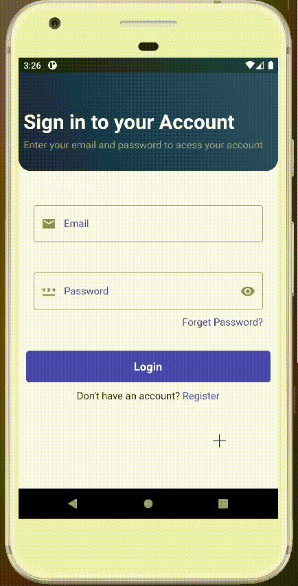
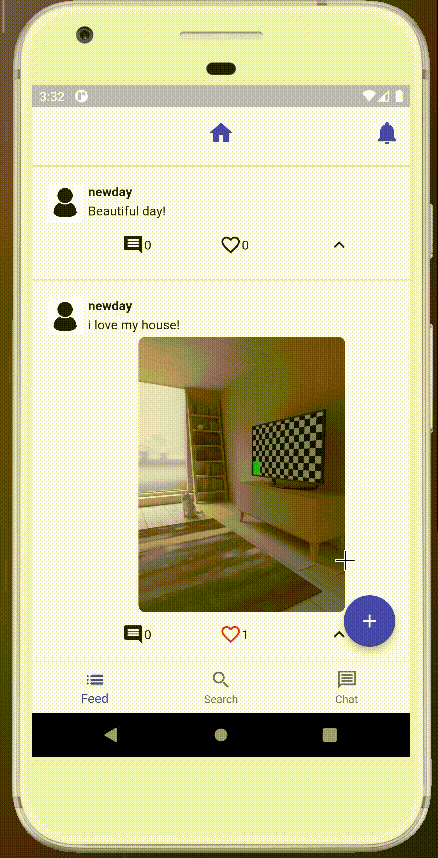
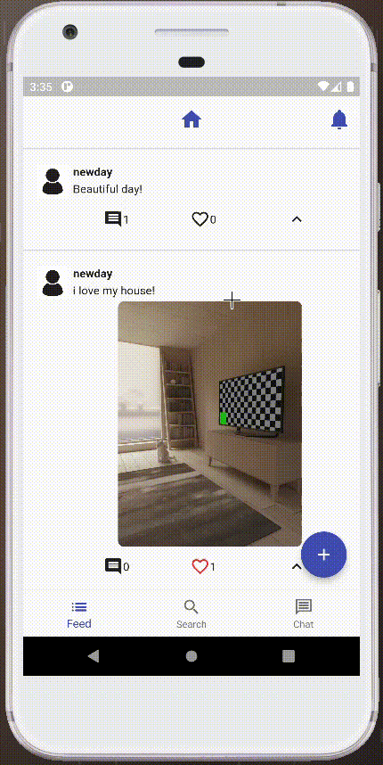
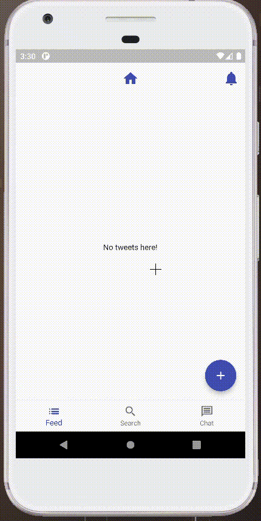

# TweetApp - Twitter-based Social Network

Welcome to the TweetApp repository, a mobile project for a social network based on Twitter, developed using Dart with Flutter. This application allows users to share their thoughts in short messages called Tweets, as well as interact with others through comments, likes, and following other users.

## Features

TweetApp currently includes the following features:

1. **User Login and Registration:** Users can create accounts, log in, and access their existing accounts.
   
2. **Tweet Creation:** Users can compose Tweets to share with their followers.

   
3. **Comment Creation:** In addition to Tweets, users can comment on other users' posts.
4. **Photo and Like System:** Users can include photos in their Tweets and comments, as well as give likes to other users' posts.

   
5. **Follow System:** Users can follow other users and view a feed of Tweets from those they follow.
6. **Personalized Feed:** The app presents a feed that combines Tweets from the users the current user is following.
7. **User Search by Identifier:** Users can search for other users by specific identifiers.

   

## How to Run the Project

1. Make sure you have Flutter installed on your machine. If you haven't installed it yet, follow the instructions at [flutter.dev](https://flutter.dev/docs/get-started/install) to install the latest stable version.
2. Clone this repository:

<pre>

bash<button class="flex ml-auto gap-2"><svg stroke="currentColor" fill="none" stroke-width="2" viewBox="0 0 24 24" stroke-linecap="round" stroke-linejoin="round" class="h-4 w-4" height="1em" width="1em" xmlns="http://www.w3.org/2000/svg"><path d="M16 4h2a2 2 0 0 1 2 2v14a2 2 0 0 1-2 2H6a2 2 0 0 1-2-2V6a2 2 0 0 1 2-2h2"></path><rect x="8" y="2" width="8" height="4" rx="1" ry="1"></rect></svg>Copy code</button>

<code class="!whitespace-pre hljs language-bash">git clone https://github.com/your-username/TweetApp.git
</code>

</pre>

3. Navigate to the project folder:

<pre>

bash<button class="flex ml-auto gap-2"><svg stroke="currentColor" fill="none" stroke-width="2" viewBox="0 0 24 24" stroke-linecap="round" stroke-linejoin="round" class="h-4 w-4" height="1em" width="1em" xmlns="http://www.w3.org/2000/svg"><path d="M16 4h2a2 2 0 0 1 2 2v14a2 2 0 0 1-2 2H6a2 2 0 0 1-2-2V6a2 2 0 0 1 2-2h2"></path><rect x="8" y="2" width="8" height="4" rx="1" ry="1"></rect></svg>Copy code</button>

<code class="!whitespace-pre hljs language-bash">cd TweetApp
</code>

</pre>

4. Create a project on Firebase at [https://console.firebase.google.com](https://console.firebase.google.com/).
5. Add the appropriate configurations for Firebase services (Firebase Auth, Firebase Firestore, and Firebase Storage) to ensure TweetApp functions correctly.
6. Run the project on an emulator or physical device:

<pre>

bash<button class="flex ml-auto gap-2"><svg stroke="currentColor" fill="none" stroke-width="2" viewBox="0 0 24 24" stroke-linecap="round" stroke-linejoin="round" class="h-4 w-4" height="1em" width="1em" xmlns="http://www.w3.org/2000/svg"><path d="M16 4h2a2 2 0 0 1 2 2v14a2 2 0 0 1-2 2H6a2 2 0 0 1-2-2V6a2 2 0 0 1 2-2h2"></path><rect x="8" y="2" width="8" height="4" rx="1" ry="1"></rect></svg>Copy code</button>

<code class="!whitespace-pre hljs language-bash">flutter run
</code>

</pre>

## State Management

TweetApp uses [Mobx](https://pub.dev/packages/mobx) for state management, a powerful library for reactive state control. Mobx makes it easy to update user interface components in response to changes in the app's state.

## Dependency and Routing Management

For dependency management and routing handling, TweetApp utilizes [Flutter Modular](https://pub.dev/packages/flutter_modular). Flutter Modular is a library that organizes and modularizes the project's structure, making it easier to maintain and scale.

## Back-End: Firebase

TweetApp utilizes Firebase services as the back-end platform, leveraging the resources provided by Firebase to ensure a smooth and reliable user experience. The Firebase setup includes:

* **Firebase Auth:** Used for user authentication, enabling secure registration and login.
* **Firebase Firestore:** Responsible for storing user information, Tweets, and the Follow system. It is a real-time database that keeps information synchronized across all connected devices.
* **Firebase Storage:** Utilized to store photos of Tweets, comments, user profile pictures, and banners.

## Contributing

Contributions are welcome! Feel free to open issues or send pull requests with improvements, bug fixes, or new features.

## License

This project is licensed under the MIT License.
